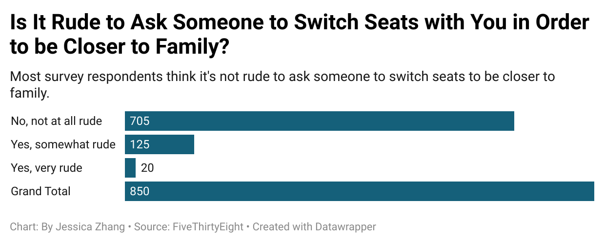

# Is It Rude to Ask Someone to Switch Seats with You in Order to be Closer to Family?
> In the raw data of "Flying Etiquette", I found a question in the survey very interesting: "Is it rude to ask someone to switch seats with you in order to be closer to family?"
> 
> In our daily lives, it is very common to hear someone who travels with their family asking others to switch seats with them; and I often do the same thing.
> 
> <ins>**However, what do people usually think of it?**</ins>
> 
> In this dataset of "Flying Etiquette", there are people with different frequencies of flying experiences, and when asking this question of switching seats, they are given three levels of answers "Yes, it is rude", "Yes, somewhat rude", and "No, not at all rude". It is interesting to see how people would react to this situation in their heart
## Chart Illustrating the Result of the Survey

> According to the chart, the majority of respondents <ins>(705 out of 850)</ins> feel that it is <ins>"Not at all rude"</ins>; a smaller portion <ins>(125 respondents)</ins> consider it <ins>"Somewhat rude"</ins>; and there are a few respondents <ins>(20)</ins>view it as <ins>"Very rude"</ins>.
> 
> The chart reveals that in this sample of 805 people, most of them feel comfortable with others asking them to change seat due to their family.
## Link to the Raw data of Flying Etiquette
[Flying Etiquette]()
